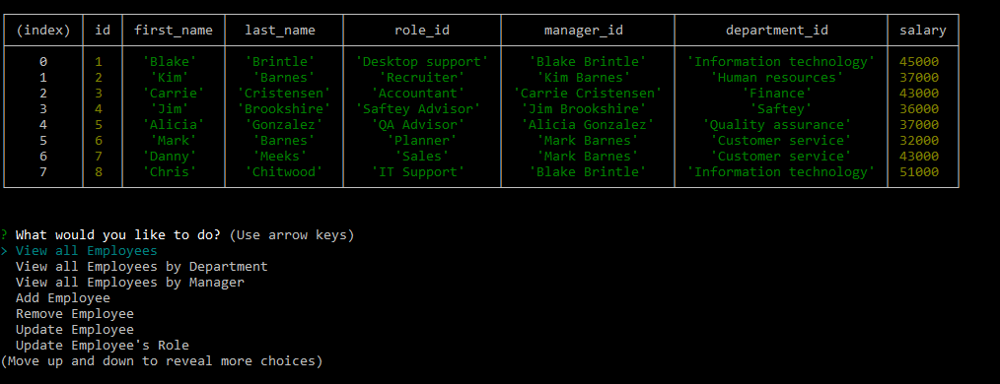
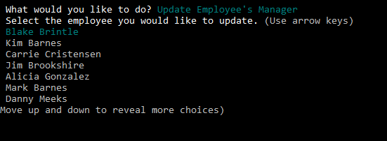

# Employee Tracker

## Table of Contents
1. [ Description ](#desc)
2. [ Installation ](#install)
3. [ Usage ](#usage)
4. [ License ](#lic)
5. [ Questions ](#quest)
    

## 1. Description
A great application that will allow you to track and manage you employees. Track Departments, Roles, Managers and Employees all in one simple stop.
    

## 2. Installation
Make sure to have the package.json file in the folder then type "npm install" in your terminal. The neccessary files will install automatically.
server.js file must be ran using node.js or nodemon
    

## 3. Usage
The console will provide you with a list of questions. Select what you would like to do. Follow the prompts and provide the correct information asked from you to complete each step.
 
<h3>Employee Manager</h3>

 
<h3>Edit and Update and Employee, Manager, Role or Department</h3>

    

## 4. License
ISC
    

## 5. Questions
Please visit my GitHub to view all of my work:
https://www.github.com/bbrintle 

Contact me at: bbrintle@gmail.com